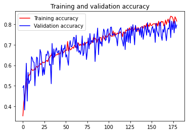
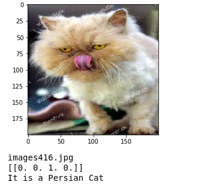

# Cat-Breed Classifier Using CNN

 The aim is to buid a classifier to categorize the breed of cats into 4 types:   'Abyssian',   'Munchkin',    'Persian',   'Toyger' on feeding the input image of a cat using the Computer Vision-Convolutional Neural Network with Tensorflow.

Here is a link to refer a sample of CNN implementation using TF: https://www.tensorflow.org/tutorials/images/cnn


1.   Cat Breed Classifier
    1. Cat-Breed-Classifier.ipynb
    2. Dataset
          1. Training:: 
              -Abyssian -Munchkin -Persian -Tygor
          2. Validation::
              -Abyssian -Munchkin -Persian -Tygor
### Steps Performed

- Setup
- Loading Dataset      
- Building a Model
- Data Preprocessing
- Training the Model
- Visualization of the Results.
- Testing the Model
- Saving the model
- Load saved model (later) 
- Conclusion 


### Model
    
    Model: "sequential_1"
    _________________________________________________________________
    Layer (type)                 Output Shape              Param #   
    =================================================================
    conv2d_6 (Conv2D)            (None, 198, 198, 32)      896       
    _________________________________________________________________
    max_pooling2d_6 (MaxPooling2 (None, 99, 99, 32)        0         
    _________________________________________________________________
    conv2d_7 (Conv2D)            (None, 97, 97, 32)        9248      
    _________________________________________________________________
    max_pooling2d_7 (MaxPooling2 (None, 48, 48, 32)        0         
    _________________________________________________________________
    conv2d_8 (Conv2D)            (None, 46, 46, 64)        18496     
    _________________________________________________________________
    max_pooling2d_8 (MaxPooling2 (None, 23, 23, 64)        0         
    _________________________________________________________________
    conv2d_9 (Conv2D)            (None, 21, 21, 64)        36928     
    _________________________________________________________________
    max_pooling2d_9 (MaxPooling2 (None, 10, 10, 64)        0         
    _________________________________________________________________
    conv2d_10 (Conv2D)           (None, 8, 8, 128)         73856     
    _________________________________________________________________
    max_pooling2d_10 (MaxPooling (None, 4, 4, 128)         0         
    _________________________________________________________________
    conv2d_11 (Conv2D)           (None, 2, 2, 256)         295168    
    _________________________________________________________________
    max_pooling2d_11 (MaxPooling (None, 1, 1, 256)         0         
    _________________________________________________________________
    flatten_1 (Flatten)          (None, 256)               0         
    _________________________________________________________________
    dense_3 (Dense)              (None, 1024)              263168    
    _________________________________________________________________
    dense_4 (Dense)              (None, 512)               524800    
    _________________________________________________________________
    dense_5 (Dense)              (None, 4)                 2052      
    =================================================================
    Total params: 1,224,612
    Trainable params: 1,224,612
    Non-trainable params: 0
    
### Train Results
<div align="center">
</img>

### Test Results
</img>
</div>
      
### Go throuhg the notebook for the results details


```
